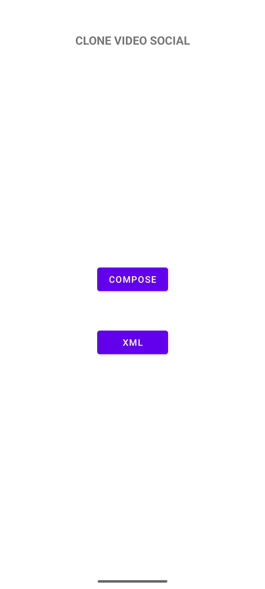

<!--suppress ALL -->
<h1 style="text-align:center;">Clone Video Social</h1>

 

 

# Introduction

This basic test application was designed as a TikTok clone. It was developed in both xml and Jetpack Compose with video cache logic

# Prerequisites

[Android Studio](https://developer.android.com/studio), [Gradle Wrapper](https://docs.gradle.org/current/userguide/gradle_wrapper.html), [Java 17](https://www.oracle.com/java/technologies/javase/jdk17-archive-downloads.html)

# Screens

# Usage

Go to pexels.com, register (it's free) and setup variables on gradle.properties file

testApiKey = "your-api-key"
 baseUrl = "https://api.pexels.com/"

Enjoy!

### Libraries

| Name                                                                                 | License    |
|--------------------------------------------------------------------------------------|------------|
| [Hilt](https://mvnrepository.com/artifact/com.google.dagger/hilt-android)            | Apache 2.0 |
| [RxJava](https://github.com/ReactiveX/RxJava)                                        | Apache 2.0 |
| [ExoPlayer](https://github.com/androidx/media)                                       | Apache 2.0 |
| [Room](https://mvnrepository.com/artifact/androidx.room/room-ktx)                    | Apache 2.0 |
| [Material3](https://mvnrepository.com/artifact/androidx.compose.material3/material3) | Apache 2.0 |
| [Compose](https://mvnrepository.com/artifact/androidx.activity/activity-compose)     | Apache 2.0 |
| [OkHttp](https://mvnrepository.com/artifact/com.squareup.okhttp3/okhttp)             | Apache 2.0 |
| [Retrofit2](https://github.com/square/retrofit)                                      | Apache 2.0 |

